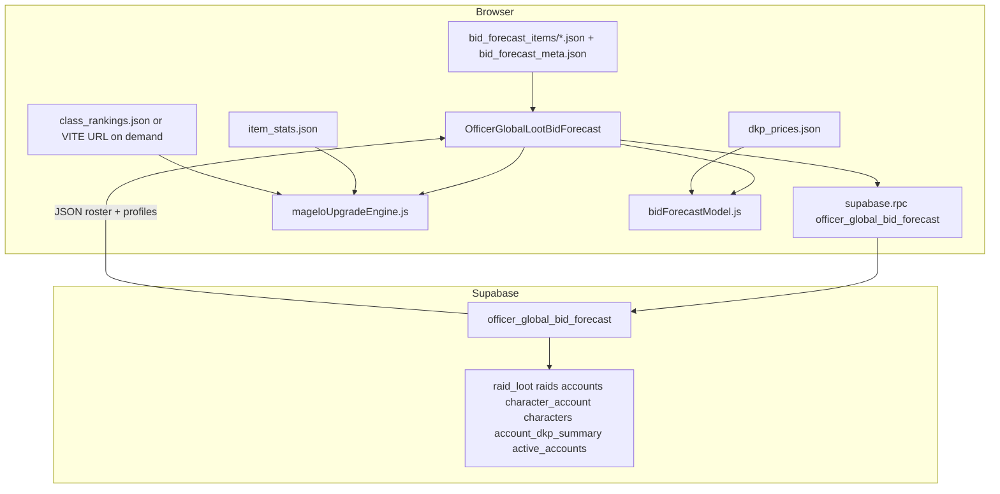

# Handoff: Global item bid forecast (active roster)

This document is the **onboarding and ownership guide** for the **Global bid** officer feature: how it works end-to-end, what the database vs browser vs static files do, and what CI does **not** do. For deploy steps shared with **Bid hints (by raid)**, see [HANDOFF_OFFICER_LOOT_BID_FORECAST.md](HANDOFF_OFFICER_LOOT_BID_FORECAST.md).

## Product intent

Officers pick **one item** (name or Allaclone id) and see a ranked list of **characters on active accounts** who might care, plus spend/balance narratives and a heuristic **bid band**. **Active** matches the DKP leaderboard idea: `account_dkp_summary.last_activity_date` within N days (default **120**, from `ACTIVE_DAYS` in [`web/src/lib/dkpLeaderboard.js`](../web/src/lib/dkpLeaderboard.js)) **or** the account is listed in **`active_accounts`** (pinned in Admin). Inactive accounts (`accounts.inactive`) are excluded.

This is **not** an auction log and **not** a guarantee of bids.

## User-facing entry points

| Route | Page |
|--------|------|
| `/officer/global-loot-bid-forecast` | [`web/src/pages/OfficerGlobalLootBidForecast.jsx`](../web/src/pages/OfficerGlobalLootBidForecast.jsx) |

Nav: **Global bid** in [`web/src/App.jsx`](../web/src/App.jsx); cross-links from Officer home and **Bid hints**.

## Architecture (what talks to what)

- **Supabase** returns **roster** (accounts → characters) and **account_profiles** (balances, per-toon spend, purchase list with optional `ref_price_at_sale` / `paid_to_ref_ratio`). It does **not** compute “gear upgrades” or “items this toon still needs.”
- **Browser** resolves the typed item to an id using **`item_stats.json`**. It prefers **per-item CI shards** under **`/bid_forecast_items/{itemId}.json`** (plus **`bid_forecast_meta.json`**, same pipeline as **Bid hints**) for upgrade copy when a row exists for that item + toon; otherwise it matches **`class_rankings.json`** (or the URL behind **`VITE_CLASS_RANKINGS_URL`**) by **name + class** and runs **Magelo-style scoring** from [`web/src/lib/mageloUpgradeEngine.js`](../web/src/lib/mageloUpgradeEngine.js). Full rankings may load **on demand** (fallback rows and **Show top upgrades by slot**).

## How “would this toon want this item?” is calculated

1. **Character identity**: Roster supplies `char_id`, `name`, `class_name` from `characters` / `character_account`. Magelo matching uses **name + class** against `class_rankings.characters[]`.

2. **Equipped baseline**: Each Magelo export character includes **`inventory`** (slot_id, item_id, item_name). That is the only source of “what they wear today” for scoring.

3. **Single-item scoring**: **`evaluateItemUpgradeForCharacter(char, itemId, ctx)`** compares the candidate item to equipped gear (slot rules, 2H + off-hand, lore, class flags). Ported from Magelo’s `class_rankings.html` / `scoreItemForUpgrade` family.

4. **Optional full upgrade lists**: For **priority** toons only (concentrated spend on that toon, or recent spend on that toon — constants in the page file), the officer can click **Show top upgrades by slot**. That runs **`computeUpgradesForCharacter`** (full scan of `item_stats` per equipped slot), same idea as Magelo’s “gear upgrades across toons” tooling.

5. **Spend / bid band**: **`bidVsMarketFromPurchasesTimeAware`** in [`web/src/lib/bidForecastModel.js`](../web/src/lib/bidForecastModel.js) builds a median **paid / reference** ratio: prefers **`paid_to_ref_ratio`** from the RPC when present, else **`cost / avg(last 3 in dkp_prices.json)`** per purchase when resolvable.

**Important:** There is **no** server-side table of “pending upgrades per character.” Freshness of gear depends on how often **`class_rankings.json`** (or the hosted URL behind **`VITE_CLASS_RANKINGS_URL`**) is regenerated from Magelo. When CI has populated **`web/public/bid_forecast_items/`**, most Global rows do not need class rankings in the browser until an officer needs live fallback or slot-deep upgrades.

## CI and pipelines

- **Bid hints precompute:** The **`bid_forecast_index`** job in [`.github/workflows/loot-to-character.yml`](../.github/workflows/loot-to-character.yml) builds **`web/public/bid_forecast_items/{itemId}.json`** shards and **`bid_forecast_meta.json`** (guild roster scope, Magelo upgrade parity via `mageloUpgradeEngine`). Requires repo secret **`CLASS_RANKINGS_URL`**. See [HANDOFF_OFFICER_LOOT_BID_FORECAST.md](HANDOFF_OFFICER_LOOT_BID_FORECAST.md).

- **Other GitHub Actions** (`sql-ledger`, `loot-to-character` assignment, db backup/restore) do **not** build `item_stats.json`, `dkp_prices.json`, or `class_rankings.json`. The takp_jsons scripts are documented as **manual / on-demand**; see [`scripts/takp_jsons/README.md`](../scripts/takp_jsons/README.md).

- **Loot-to-character** assigns **who has** past loot on Magelo dumps; it does **not** drive upgrade wishlists or bid interest for a *new* item.

- **Magelo repo / your export job** is the natural place to **produce** `class_rankings.json` (or host it). The DKP site **consumes** that artifact like the static Magelo rankings page.

- **Vercel** deploys whatever is in `web/public/` (and env at build time). No extra CI step is required **for the JSONs to exist** if they are already committed or configured via `VITE_CLASS_RANKINGS_URL`.

### Vercel: class rankings without a huge repo file

You do **not** need to commit multi‑MB **`class_rankings.json`** into `web/public/`. Set a **build-time** env var on Vercel:

- **`VITE_CLASS_RANKINGS_URL`** — full URL to a hosted `class_rankings.json` (same shape as the Magelo export). Example maintained elsewhere: `https://ammordius.github.io/NAGD-spell-inventory/class_rankings.json`.

Align this with GitHub secret **`CLASS_RANKINGS_URL`** when you want CI precompute and browser live fallback to use the **same** export. Officers can still use **Reload Magelo JSON** to refetch after deploy.

## Deploy and operations checklist (global-specific)

1. **SQL**: Apply [`docs/supabase-schema-full.sql`](supabase-schema-full.sql) on the **same** Supabase project the app uses (including production). It includes `normalize_item_name_for_lookup` and `officer_global_bid_forecast` in the **Officer bid forecast RPCs** section near the end.

2. **Static assets**
   - `web/public/item_stats.json` — required to resolve item **names** to ids and for scoring.
   - `web/public/dkp_prices.json` — fallback anchor and static “last 3” style reference when RPC has no prior guild sales for a purchase.
   - `web/public/bid_forecast_items/*.json` + `bid_forecast_meta.json` (from CI) — preferred source of upgrade lines per item on this page; avoids loading full class rankings for most rows.
   - `class_rankings.json` in `web/public/` **or** `VITE_CLASS_RANKINGS_URL` — needed for **live** scoring when precompute misses, and for **Show top upgrades by slot** (full `inventory`). Not required for RPC-only data.

3. **Keep SQL + JS name normalization aligned**: `public.normalize_item_name_for_lookup` must stay consistent with [`web/src/lib/itemNameNormalize.js`](../web/src/lib/itemNameNormalize.js) for ref-price matching on loot names.

## Key source files

| Concern | File |
|--------|------|
| Global UI | [`web/src/pages/OfficerGlobalLootBidForecast.jsx`](../web/src/pages/OfficerGlobalLootBidForecast.jsx) |
| RPC + normalizer | [`docs/supabase-schema-full.sql`](supabase-schema-full.sql) |
| Magelo parity scoring | [`web/src/lib/mageloUpgradeEngine.js`](../web/src/lib/mageloUpgradeEngine.js) |
| Bid ratios / bands | [`web/src/lib/bidForecastModel.js`](../web/src/lib/bidForecastModel.js) |
| Active days default | [`web/src/lib/dkpLeaderboard.js`](../web/src/lib/dkpLeaderboard.js) (`ACTIVE_DAYS`) |

## Troubleshooting

| Symptom | Likely cause |
|---------|----------------|
| RPC error / permission | SQL not applied, or user not officer (`is_officer()`). |
| No upgrade lines, yellow warning | No precompute row and no `class_rankings` loaded yet (file, env URL, or use **Reload Magelo JSON**). |
| “Could not resolve item id” | Item missing from `item_stats.json` or name mismatch vs Allaclone naming. |
| All `paid_to_ref_ratio` null | First guild sales for those item names, or zero prior sales in `raid_loot`. |
| Stale gear vs reality | Regenerate / redeploy **`class_rankings.json`** from Magelo. |
| Slow “Run” on large DB | Historically: per-purchase ref-price subqueries; current SQL uses a window over positive-cost guild sales (re-apply the bid-forecast section from [`supabase-schema-full.sql`](supabase-schema-full.sql)). If still slow, add indexes / denormalized sale date per main handoff. |

## Follow-ups (ideas)

- Automate publishing **`class_rankings.json`** (Magelo CI → URL → `VITE_CLASS_RANKINGS_URL` on Vercel).
- Add the same **`ref_price_at_sale`** fields to **`officer_loot_bid_forecast`** for parity on the by-raid page.
- Optional: server-precached upgrade lists (heavy; only if browser cost becomes an issue).

## Related doc

- [HANDOFF_OFFICER_LOOT_BID_FORECAST.md](HANDOFF_OFFICER_LOOT_BID_FORECAST.md) — combined deploy checklist, by-raid RPC notes, quick tests.
